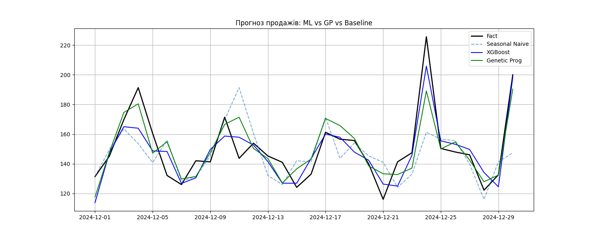

# 📈 Прогнозування продажів: ML vs Genetic Programming


Цей репозиторій містить рішення практичного завдання №13. Проєкт порівнює ефективність класичного машинного навчання (**XGBoost**) та еволюційних методів (**Генетичне програмування**) для задачі прогнозування попиту в ритейлі.

## 📊 Результати прогнозування
Нижче наведено графік порівняння прогнозів моделей з фактичними даними на тестовому періоді:



### Порівняння метрик (Test Set)
Найкращу точність показала модель **XGBoost**, знизивши помилку майже вдвічі порівняно з базовим прогнозом.

| Модель | MAE | RMSE | MAPE (%) |
| :--- | :--- | :--- | :--- |
| Seasonal Naive (Baseline) | 15.26 | 21.80 | 9.69% |
| **Genetic Programming** | 9.44 | 12.42 | 6.29% |
| **XGBoost (Best)** | **8.54** | **10.79** | **5.73%** |

## 🛠 Технології та Методи
- **Мова:** Python
- **Бібліотеки:** `pandas`, `scikit-learn`, `xgboost`, `gplearn`, `matplotlib`
- **Feature Engineering:** Лаги (lags), ковзні середні (rolling windows), календарні ознаки.
- **Genetic Programming:** Символьна регресія для пошуку аналітичної формули залежності.

## 📂 Структура репозиторію
- `sales_forecast.ipynb` — Основний код (генерація даних, навчання, оцінка).
- `REPORT.md` — Повний звіт з бізнес-висновками.
- `xgb_model.pkl` — Навчена модель XGBoost (артефакт).
- `gp_model.pkl` — Навчена модель SymbolicRegressor (артефакт).
- `requirements.txt` — Залежності проєкту.
- `forecast_graph.png` — Візуалізація результатів.

## 🚀 Як запустити

1. Клонуйте репозиторій:
   ```bash
   git clone [https://github.com/sonv1x/sales-forecast.git](https://github.com/sonv1x/sales-forecast.git)
2. Встановіть необхідні бібліотеки:
   ```bash
   pip install -r requirements.txt
3. Запустіть Jupyter Notebook:
   ```bash
   jupyter notebook sales_forecast.ipynb
  
